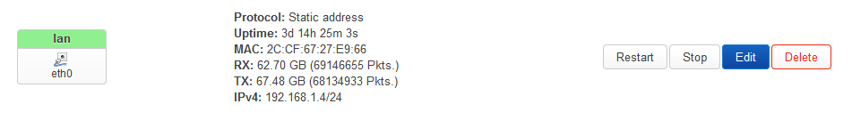

# AdGuard

To put it simply, AdGuard Home will act as a DNS resolver and help us block the majority of the ads on the internet. It can also encrypt your DNS requests via DoT and DoH, resulting in bypassing your ISP policy in most cases.

This is a simplified guide based on the official [OpenWRT AdGuard Home guide](https://openwrt.org/docs/guide-user/services/dns/adguard-home) and [this helpful post in OpenWRT forum](https://forum.openwrt.org/t/how-to-updated-2021-installing-adguardhome-on-openwrt-manual-and-opkg-method/113904/685)

## Install AdGuard Home in OpenWRT

SSH into OpenWRT and type the following commands:
```sh
opkg update
opkg install adguardhome
```

Then restart the service to allowed it auto boot:
```sh
service adguardhome enable
service adguardhome start
```

Edit the interfaces via `Network > Interfaces`, click `Edit` in the `lan` interface.


By default, the `LAN` interface will use `br-lan` as its device, which is not needed in our case. I would suggest you change it to `eth0`.


Run the following command via `SSH`, which I copied from the OpenWRT AdGuard Home guide with some edits.
```sh
NET_ADDR=$(/sbin/ip -o -4 addr list eth0 | awk 'NR==1{ split($4, ip_addr, "/"); print ip_addr[1] }')

# 1. Enable dnsmasq to do PTR requests.
# 2. Reduce dnsmasq cache size as it will only provide PTR/rDNS info.
# 3. Disable rebind protection. Filtered DNS service responses from blocked domains are 0.0.0.0 which causes dnsmasq to fill the system log with possible DNS-rebind attack detected messages.
# 4. Move dnsmasq to port 54.
# 5. Set Ipv4 DNS advertised by option 6 DHCP
# 6. Set Ipv6 DNS advertised by DHCP
uci set dhcp.@dnsmasq[0].noresolv="0"
uci set dhcp.@dnsmasq[0].cachesize="1000"
uci set dhcp.@dnsmasq[0].rebind_protection='0'
uci set dhcp.@dnsmasq[0].port="54"
uci -q delete dhcp.@dnsmasq[0].server
uci add_list dhcp.@dnsmasq[0].server="${NET_ADDR}"

#Delete existing config ready to install new options.
uci -q delete dhcp.lan.dhcp_option
uci -q delete dhcp.lan.dns

# DHCP option 6: which DNS (Domain Name Server) to include in the IP configuration for name resolution
uci add_list dhcp.lan.dhcp_option='6,'"${NET_ADDR}"

# DHCP option 3: default router or last resort gateway for this interface
uci add_list dhcp.lan.dhcp_option='3,'"${NET_ADDR}"

uci commit dhcp
/etc/init.d/dnsmasq restart
```

## Setup AdGuard Home

Go to `192.168.1.4:3000` to begin setting up AdGuard Home. You can also change your web port here, such as to `8080`. Just remember to set the DNS server to `192.168.1.4` port `53`. If you changed your web port like me, after saving the settings, you have to access AdGuard Home via `192.168.1.4:8080`.


---

### Allowed your router connect to the internet

After completing the above steps, your router won't be able to connect to the internet. You would need to stop the `adguardhome` service:
```sh
service adguardhome stop
```

Edit the AdGuard Home `.yaml` file:
```sh
nano /etc/adguardhome.yaml
```

Add your router IP into `bind_hosts`:
```yml
dns:
  bind_hosts:
  - 127.0.0.1
  - 192.168.1.4
```

And start the `adguardhome` service afterward:
```sh
service adguardhome start
```

---

## AdGuard Home configuration

### General settings

You can set the log rotation duration here, but the longer the duration, the more memory it consumes as AdGuard Home uses RAM for logs, same with OpenWRT.

---

### DNS settings
In the `Upstream DNS servers` setting text box, paste the following:
```
# We're using DoH encrytion DNS server
https://dns.google/dns-query
https://dns.cloudflare.com/dns-query
https://dns.quad9.net/dns-query

# Add the following to ensure any DNS request for NTP uses plain DNS
[/pool.ntp.org/]1.1.1.1
[/pool.ntp.org/]1.0.0.1

# Enable statistics tracking
[/lan/]127.0.0.1:54
[//]127.0.0.1:54
```

Explaination on why we use the above setting:
- Why use DoH?
	- Since plain DNS uses port `53`, your ISP can easily redirect all packets to that port to their DNS server and read your requests.
	- DoT (DNS over TLS) uses port `853`, which your ISP can also easily block access to and make your devices switch back to plain DNS.
	- DoH (DNS over HTTPS) uses port `443`, which is the same as every other `HTTPS` request, making blocking it much harder. The downside of this protocol is the processing time will be longer (but still fast from a human perspective).
	- An important note to remember is that although you can avoid blocking from your ISP DNS server, your ISP can still block connection to any IP they want.
- Given encrypted DNS relies heavily on certificates, having accurate time is more important. To prevent this, we allow NTP DNS requests to use plain DNS, regardless of the upstream DNS resolvers set.

In the next setting, select `Parallel requests`.

You could enter some popular DNS servers such as `1.1.1.1` and `8.8.8.8` into `Fallback DNS servers` box to allow your devices to continue to access the internet in case AdGuard Home fails, but I'm leaving it empty.

When AdGuard Home starts up, it won't know what the IP addresses of the upstream servers are. `Bootstrap DNS servers` will help to resolve that:
```
1.1.1.1
1.0.0.1
8.8.8.8
8.8.4.4
9.9.9.9
149.112.112.112
```

Set `Private reverse DNS servers` to:
```
192.168.1.4:54
```

Check both `Use private reverse DNS resolvers` and `Enable reverse resolving of clients' IP addresses`.

Click `Test upstreams` to see if it works and `Apply` if it is positive.

---

### DNS blocklists

You can either add the AdGuard Home recommended blocklists or add the following:
```
DOH Bypass - Encrypted DNS Servers
https://raw.githubusercontent.com/hagezi/dns-blocklists/main/adblock/doh.txt

Multi PRO++ - Maximum protection
https://raw.githubusercontent.com/hagezi/dns-blocklists/main/adblock/pro.plus.txt

Threat Intelligence Feeds - Medium version
https://raw.githubusercontent.com/hagezi/dns-blocklists/main/adblock/tif.medium.txt
```

They are all part of [Hagezi blocklists](https://github.com/hagezi/dns-blocklists) and they are doing a very good job. Please be aware that the bigger the list, the heavier the load your Raspi will be put under, but it is not necessarily better.

## Force all DNS traffic goes through AdGuard Home

As some devices will bypass our DNS servers, create the following rules in the OpenWRT firewall via `Network > Firewall`:

- In `Port Forwards`:


- In `NAT Rules`:


Alternative, you can also do this via `SSH` (not recommended for beginner):
```sh
nano /etc/config/firewall
```

```ssh-config
config redirect
	option dest 'lan'
	option target 'DNAT'
	option src 'lan'
	option src_dport '53'
	option name 'AdGuardHome DNS Interception'
	option src_ip '!192.168.1.4'
	option dest_ip '192.168.1.4'
	option dest_port '53'

config nat
	option name 'Prevent hardcoded DNS'
	list proto 'tcp'
	list proto 'udp'
	option src 'lan'
	option dest_ip '192.168.1.4'
	option dest_port '53'
	option target 'MASQUERADE'
```