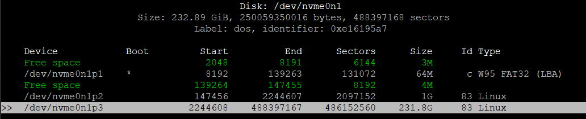

# Extend Docker Storage

Since the default of OpenWrt root space is very limited, we would need to create another partition in our `NVME` and use it for containers.

First, we need to know our `NVME` drive path:
```sh
block info
```

OpenWrt, by default will have 2 partitions ready, e.g:
```sh
/dev/nvme0n1p1: UUID="69F9-1E15" LABEL="boot" VERSION="FAT16" MOUNT="/boot" TYPE="vfat"
/dev/nvme0n1p2: UUID="ff313567-e9f1-5a5d-9895-3ba130b4a864" LABEL="rootfs" VERSION="1.0" MOUNT="/" TYPE="ext4"
```

Based on the above output, we know that our `NVME` is located at `nvme0n1`.

Assuming there is still unused space on the `NVME`, we will create a new partition and format it. There are many tools to do this, but I will use `cfdisk` since it has a more intuitive layout:

```sh
apk update
apk add cfdisk
```

After installation, we will run the following command:
```sh
cfdisk /dev/nvme0n1
```

Select the last `Free Space`, press `Enter` twice to use the default `Size` and `Type`. Then select `Write` to create the partition.

You can verify the newly created partition with the same command above.



Mount the newly created partition with the following command:
```sh
mount /dev/nvme0n1p3 /mnt/nvme0n1p3
```

Finally, change the `Docker Root Dir` to `/mnt/nvme0n1p3` by accessing `LuCI` and navigating to `Services > Dockerman JS > Configuration > Docker Root Dir`.