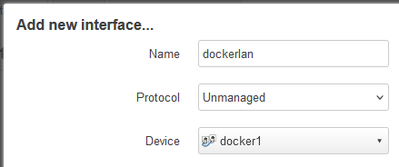
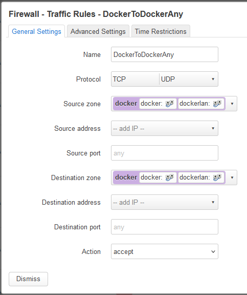

# Docker

As Docker is already installed in OpenWRT, you can find it easily in the `LuCI` menu or, if you prefer commands, simply `SSH` into OpenWRT.

However, if you want containers to connect to each other, it won't work by default.

To allow it, you have to do the following steps:
- Create a new bridge device via `Network > Interfaces > Devices`:

- Add an unmanaged interface in `LuCI`, covering the `docker1`:

- Go to `Network > Firewall > General Settings`, edit the `docker` zone:

	- In `General Settings`:
	
	- In `Advanced Settings`:
	
- Go to `Network > Firewall > Traffic Rules`, add a new rule:

- Create the following network:
```sh
docker network create -o "com.docker.network.bridge.name"="docker1" dockerlannetwork
```
- At the end of your `docker-compose.yml`, add the following network:
```yml
networks:
  default:
    name: dockerlannetwork
    external: true
```

Reference at [here](https://forum.openwrt.org/t/openwrt-with-docker-docker-compose-network/150228/4) and [here](https://forum.openwrt.org/t/how-to-configure-custom-docker-compose-network/197070/5).