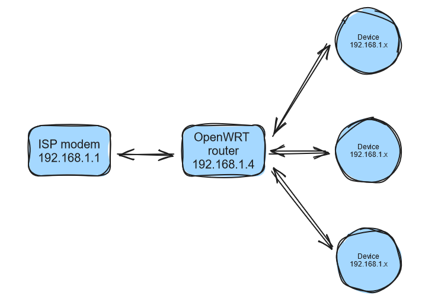

# Getting Started

This guide is based on a Raspberry Pi 5 with 8GB RAM and a 256GB M.2 NVMe PCIe SSD.

Usually, people recommend using a MicroSD card with the Raspberry Pi (from this point, I'll refer to it as Raspi) and installing the OS on it. However, if you want to use a MicroSD card, you will also need to purchase a MicroSD card reader.

Since I can't think of many cases where I would benefit from owning a reader, I decided not to purchase one. As a consequence, I will install the OS on my SSD. The I/O speed will be significantly faster, but please be aware that it will also cause the SSD to degrade faster.

Besides that, I want to connect to my Raspi via the network only, so no additional purchases such as a micro HDMI cable are needed.

Since I already have a USB drive, I will use it as a secondary OS. Therefore, the process to install the primary OS on the SSD will include a few additional steps.

Below is my soon-to-be network topology:
