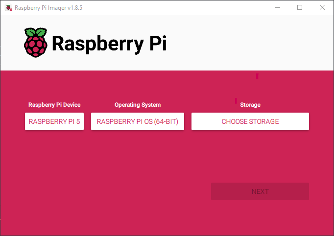
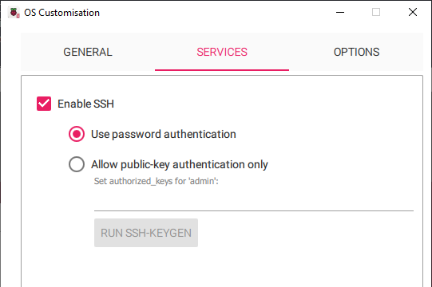

# Install OS

Why do I need a secondary OS, you asked? There are 2 reasons why I need it:
- To flash the primary OS into my SSD.
- To edit the configs in my primary OS.

There are many tool to flash an OS into your devices, but in my case, I will use Raspberry Pi Imager which can be download via the following [link](https://www.raspberrypi.com/software/).

## Install the Raspberry Pi OS

Run Raspberry Pi Imager and select the same options as me, the `Storage` option obviously will be your USB (or any removeable devices you want).


Click `EDIT SETTINGS` when promted.


The next window should be straightforward, I only remind you to enable `SSH` in `Service` tab as this is required for what we're aming to. When you enable this setting, it will ask you set up the username and password as well so let do that.


Click `Save` and then `Yes` to proceed with flash. After it completed, plug your USB into Raspi to boot the Raspberry Pi OS.

Check your Raspi's IP in your router and `SSH` into it. I also recommend you enable `VNC` as it will help you go through this easier. To do this, `SSH` into our Raspi and open `raspi-config` via
```sh
sudo raspi-config
```
Go to `Interface > VNC` and then select `Yes` when promted. You now can connect to Raspi with a VNC client such as [TigerVNC](https://github.com/TigerVNC/tigervnc/releases).

The next step is assign a static IP for it as we are intending to use it as a router. I will also give my primary OS the same IP later as it is easier to remember althought this is not required. You can do this either via GUI after connected via VNC or edit `dhcpcd` file with the following command:
```sh
sudo nano /etc/dhcpcd.conf
```
It my case, the static IP address is `192.168.1.4`.

## Install the OpenWRT

[OpenWRT](https://openwrt.org/) is one of the most famous and actively developing open source router OS. It have a buildin Docker and a ready-to-use AdGuard package, they are some of the reasons why I choose this OS.

As of now, OpenWRT is only available as a pre-release snapshot for Raspi 5, you can access the `2024.09.12` snapshot via the following [link](https://github.com/mj22226/openwrt/releases/tag/bcm2712-6.6). We will use the `ext4-factory` file in our case.

The ones with `factory` mean it is for flash a different OS to the OpenWRT, while `sysupgrade` mean to replace the current OpenWRT OS to a different version.

As for `ext4` and `squashfs`, they are both popular filesystems on Linux system.
- `ext4` is a regular Linux filesystem where you can write and read data from/to it, you can expand the storage with it.
- `squashfs` is a read-only compressed filesystem, suitable for embeded device with small storage. You can easily do a factory restore easily with this filesystem. If you want to try different configurations, packages, this is the one you need.

As Raspberry Pi OS come with Raspberry Pi Imager already. We will use it to flash the OpenWRT into the SSD.

Download OpenWRT image with
```sh
wget https://github.com/mj22226/openwrt/releases/download/bcm2712-6.6/openwrt-bcm27xx-bcm2712-rpi-5-ext4-factory.img.gz
```
`VNC` into your Raspi and open Raspberry Pi Imager. Repeat the same steps where you flash the Raspberry Pi OS, only this time, in `Operating System` option, scroll to the bottom and click `Use custom` to select your downloaded OpenWRT image and select your SSD in `Storage` option.

When asked to apply OS customisation settings, choose `No`.

When the flash is finished, shutdown your Raspi via:
```sh
sudo shutdown -h now
```

The next few steps are quite hassle:
- Plug out your USB and bootup the Raspi again.
- Wait for a few minitues to allowed OpenWRT initilize system files and then force a hard shutdown by press and hold the physical power button or simply disconnect the power plug.
- Plug in the USB with the Raspberry Pi OS into it again and bootup the Raspi.
- `SSH` into it again and list out the connect devices:
```sh
lsblk
```
- Noted down your SSD ID and then mount it with the following command - `nvme0n1p2` is my SSD ID:
```sh
mount nvme0n1p2
```
- Change the OpenWRT static IP by edit `ipaddr` in `network`:
```sh
sudo nano /media/admin/rootfs/etc/config/network
```
```ssh-config
config interface 'lan'
        option device 'br-lan'
        option proto 'static'
        option ipaddr '192.168.1.4'
```

- Finally, shutdown the Raspi by the same shutdown command above and plug out your USB.
- Bootup your Raspi again. Wait for a few minutes and access OpenWRT via your web brower using the same static IP you set above.

Leave the password as blank and login to OpenWRT via web interface, which is called `LuCI`. Don't forget to change the default password in `System > Router Password` and enable `SSH` in `System > SSH Access`.

### Disable DHCPv6

I also disabled `DHCPv6` in my OpenWRT as I haven't seens any real benefit of `IPv6` in my lan and I can see many people having problems with it on the internet. This, of course may change in the future.
- Disable `RA-Service`, `DHCPv6-Service`, `NDP-Proxy` and `Designated Master` in `Network > Interfaces > Edit lan interface > DHCP Server > IPv6 Settings`

- Disable `IPv6 assignment length` in `Network > Interfaces > Edit lan interface > Advanced Settings`

[Reference](https://forum.openwrt.org/t/disable-ipv6-in-openwrt-lan-and-wan/199365/5)

For some cases, you will also need to disable the `DHCPv6` in your internet router as well. Since I'm using `Viettel` router, I simply access my router and disable it in `Administration > IPv6 Switch`.