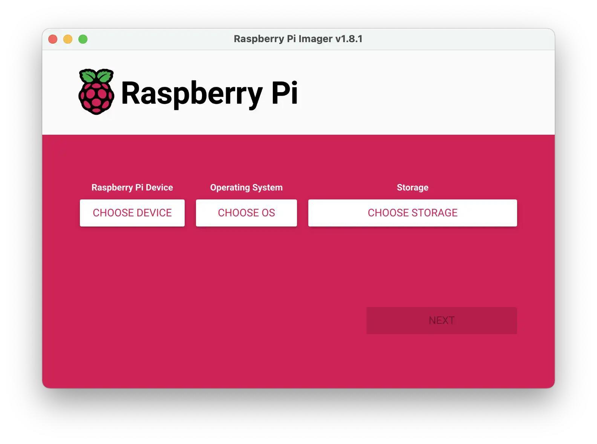

# Install OS

## Install the Raspberry Pi OS

Why do I need a secondary OS, you asked? There are 2 reasons why I need it:
- To flash the primary OS into my SSD.
- Edit the configs in my primary OS.

There are many tool to flash an OS into removable devices, but in my case, I will use Raspberry Pi Imager which can be download via the following [link](https://www.raspberrypi.com/software/).

Only the first 2 options are needed to be the same, the `Storage` option obviously will be your removeable device.


When promoted with asking if edit setting is need, select `Edit Setting`.


I'm setting the static IP of this OS to `192.168.1.4` (I will also give my primary OS the same IP as it is easier to remember althought this is not required) but you can input any reserved IP you want. Don't forget to enable `SSH`.


## Install the OpenWRT

[OpenWRT](https://openwrt.org/) is one of the famously and actively developing open source router OS. It have a buildin Docker, this is one of the reason why I choose this OS.

As of now, OpenWRT is available as a snapshot pre-release for Raspi 5, you can access the `2024.09.12` snapshot via the following [link](https://github.com/mj22226/openwrt/releases/tag/bcm2712-6.6). We will use the `ext4-factory` file in our case.
```
ext4-factory:
ext4-sysupgrade.img.gz
squashfs-factory.img.gz
squashfs-sysupgrade.img.gz 
```