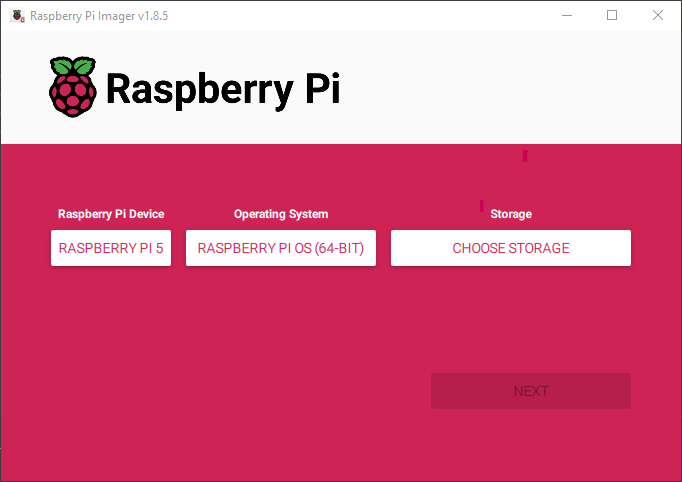
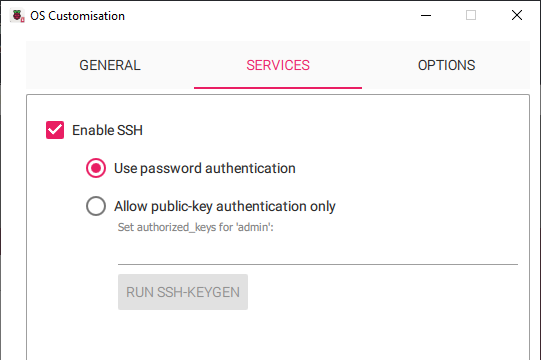

# Install Raspberry Pi OS

Run Raspberry Pi Imager and select the same options as mine. The `Storage` option will obviously be your USB (or any removable device you want).


Click `EDIT SETTINGS` when prompted.


The next window should be straightforward. I only remind you to enable `SSH` in the `Service` tab as this is required for what we're aiming to do. When you enable this setting, it will ask you to set up the username and password as well, so let's do that.


Click `Save` and then `Yes` to proceed with the flash. After it is completed, plug your USB into the Raspi to boot the Raspberry Pi OS.

Check your Raspi's IP in your router and `SSH` into it. I also recommend you enable `VNC` as it will help you go through this more easily. To do this, `SSH` into your Raspi and open `raspi-config` via:
```sh
sudo raspi-config
```
Go to `Interface > VNC` and then select `Yes` when prompted. You can now connect to Raspi with a VNC client such as [TigerVNC](https://github.com/TigerVNC/tigervnc/releases).

The next step is to assign a static IP for it as we are intending to use it as a router. I will also give my OpenWrt OS the same IP later as it is easier to remember, although this is not required. You can do this either via GUI after connecting via VNC or editing the `dhcpcd` file with the following command:
```sh
sudo nano /etc/dhcpcd.conf
```
In my case, the static IP address is `192.168.1.4`.